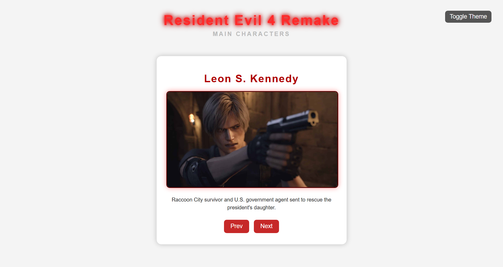
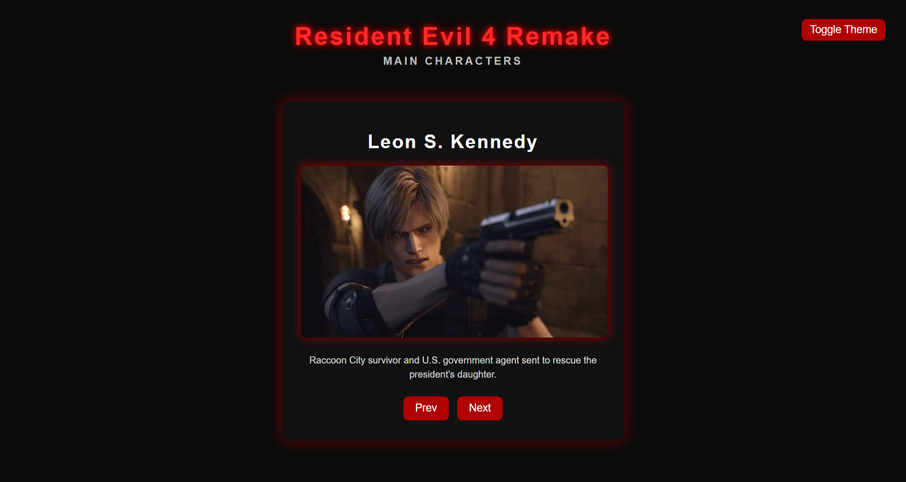

# Resident Evil 4 Remake Character Gallery

A small frontend project presenting the main characters from Resident Evil 4 Remake using an interactive JavaScript slider.

The site allows users to browse characters, read short descriptions, and switch between dark and light themes.

---

## Features

- Character gallery slider
- JavaScript DOM manipulation
- Dark / Light theme toggle
- Character descriptions
- Responsive card layout
- Simple and clean UI

---

## Technologies

- HTML
- CSS
- JavaScript

No backend or database is used.  
All character data is stored in a JavaScript array.

---

## Screenshots

### Light theme

### Dark theme

---

## How it works

The website uses a JavaScript array containing character data:

- name
- image
- description

The slider changes the current index in the array and updates the DOM elements dynamically.

---

## Project structure

re4-character-gallery
- index.html
- style.css
- js
-- slider.js
- images
- screenshots

---

## Learning goals

This project demonstrates:

- basic JavaScript logic
- DOM manipulation
- event handling
- UI state switching (theme toggle)
- simple frontend project structure
